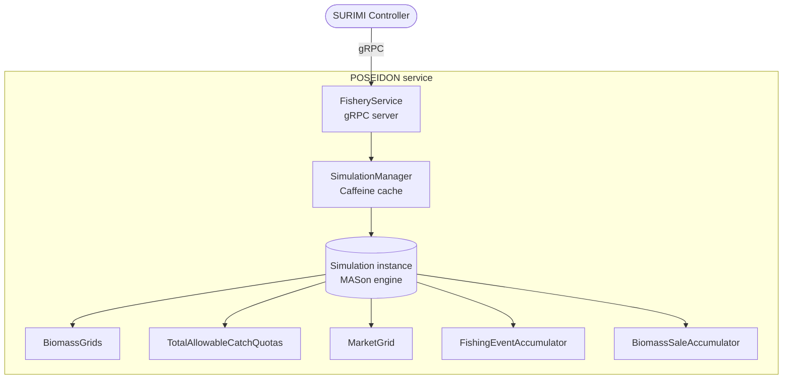
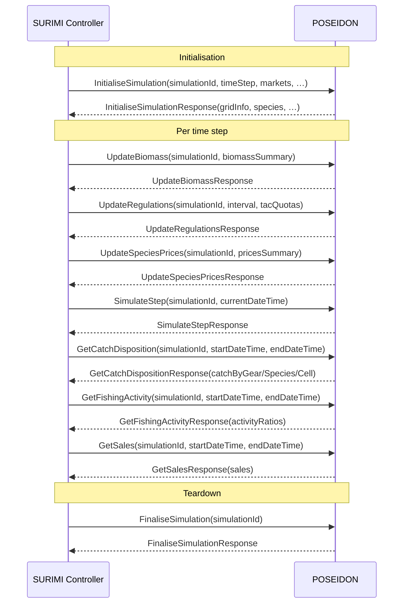

# POSEIDON — Architecture

## Overview

POSEIDON is an **agent-based model (ABM) of fisheries** developed at the University of Oxford. It
is part of the **SURIMI** (Simulation Used for Resource and Indicator Management Integration)
framework and acts as the fleet / fishery simulation service. POSEIDON is responsible for
simulating the behaviour of fishing vessels, their catches, earnings, and regulatory compliance
over time.

Within SURIMI, POSEIDON communicates exclusively with the **SURIMI controller** over **gRPC**.
It never contacts other SURIMI models directly. The controller drives the simulation lifecycle and
exchanges fisheries state (biomass, regulations, prices, catch data, sales) at each time step.

---

## Responsibilities

- Load and hold a configurable fishery **scenario** (e.g., Northwestern Mediterranean).
- Manage the lifecycle of one or more concurrent **simulation instances**, each identified by a UUID.
- Advance a simulation by a configurable **time step** (typically one month) on request.
- Accept updated **biomass grids** from the ecology model (relayed by the controller) and apply
  them to the internal simulation state.
- Accept updated **TAC (Total Allowable Catch) quotas** and apply them as fishing regulations.
- Accept updated **species market prices** and propagate them to the internal market grid.
- Return **catch-disposition summaries** (landed, discarded alive, discarded dead) per gear,
  species, and grid cell.
- Return **fishing-activity ratios** per fleet segment and species for an arbitrary time interval.
- Return **sales summaries** (quantity and value) per species, gear, and catch category.
- Report the implemented **SURIMI protocol version** for compatibility checks.

---

## Interfaces

All methods are part of the single `FisheryService` gRPC service (proto package `surimi.v1`).
POSEIDON acts only as a **gRPC server**; it does not call any other service.

### Lifecycle messages

| Method | Direction | Description |
|--------|-----------|-------------|
| `InitialiseSimulation` | Controller → POSEIDON | Create and start a new simulation instance from the scenario; returns grid dimensions, species list, and market/category metadata. |
| `SimulateStep` | Controller → POSEIDON | Advance the simulation by one configured time step. |
| `FinaliseSimulation` | Controller → POSEIDON | Gracefully end a simulation and free all resources. |
| `CancelSimulation` | Controller → POSEIDON | Abruptly drop a simulation reference without calling `finish()`. |
| `GetProtocolVersion` | Controller → POSEIDON | Return the SURIMI protocol version implemented by this service. |

### Domain messages

| Method | Direction | Description |
|--------|-----------|-------------|
| `UpdateBiomass` | Controller → POSEIDON | Overwrite internal biomass grids with values provided by the ecology model. |
| `UpdateRegulations` | Controller → POSEIDON | Set TAC quotas per fleet segment and species for a given time interval. |
| `UpdateSpeciesPrices` | Controller → POSEIDON | Update fish prices per market, species, and catch category. |
| `GetCatchDisposition` | Controller → POSEIDON | Return gross catch, discards-alive, and discards-dead per gear/species/cell for a time window. |
| `GetFishingActivity` | Controller → POSEIDON | Return the TAC-usage ratio per fleet segment and species for a time interval. |
| `GetSales` | Controller → POSEIDON | Return landed quantity and monetary value per species, gear, and catch category for a time window. |

---

## Model theory

POSEIDON is built on several interacting theoretical concepts:

**Agent-Based Model (ABM)**  
Fishing vessels are modelled as autonomous agents. Each vessel independently decides when to
depart, where to fish, how long to stay at sea, and when to return to port, based on its own
experience and limited social information.

**Discrete-time, discrete-space simulation**  
The ocean is represented as a raster grid derived from a bathymetric dataset. The simulation
advances in configurable time steps (typically monthly). Each grid cell can be an active water
cell or excluded (land / protected area).

**Biomass dynamics with carrying capacity**  
Fish biomass is distributed across the spatial grid up to a per-cell carrying capacity. Biomass
is treated as a scalar (kg) per species per cell and is updated externally each step by the
ecology model.

**Reinforcement learning / bandit-style destination choice**  
Vessels maintain exponential-moving-average option values for each grid cell. On each trip they
choose a destination by ε-greedy exploration: with probability ε they explore a random nearby
cell; otherwise they imitate the best-performing cell known to their social network of peers
sharing the same home port.

**Regulations: Total Allowable Catch (TAC)**  
TAC quotas are tracked per fleet-segment / species combination by a `TotalAllowableCatchQuotas`
component. Vessels can only depart when their fleet segment still has quota remaining for the
period. The controller sets quotas each time step via `UpdateRegulations` and queries usage via
`GetFishingActivity`.

**Gear-specific catchability**  
Each gear type (e.g., Purse Seine `PS`, Bottom Trawl `OTB`) has a gear-specific catchability
coefficient per species. Catch is proportional to local biomass and the coefficient. Vessels
carry infinite holds in the current NW-Med parameterisation.

**Discard dynamics**  
A fraction of the gross catch is discarded depending on gear type. Discards are modelled as
either alive (animals survive) or dead, using species- and gear-specific discard rates.

**Market prices and sales accounting**  
Landed catch is sold at market prices read from a spatially distributed market grid. Revenue is
recorded in a `BiomassSaleAccumulator`. Prices can be updated at any step via
`UpdateSpeciesPrices`.

---

## Service architecture

### High-Level Architecture



**Interceptor stack** (outermost to innermost):

```
ExceptionInterceptor       ← enriches error trailers with method + application name
GrpcTelemetry interceptor  ← emits OpenTelemetry spans
TrailerInterceptor         ← appends protocol-version to every response trailer
ValidationInterceptor      ← validates incoming protobuf messages via protovalidate
FisheryService             ← business logic
```

### Message flow



### Key design decisions / trade-offs

**Multiple concurrent simulations via UUID-keyed cache**  
`SimulationManager` stores live `Simulation` objects in a Caffeine cache keyed by UUID. This
allows the controller to run ensemble simulations (e.g., Monte-Carlo runs) in a single service
instance without restarting the JVM. The trade-off is that each live simulation consumes
significant heap.

**Lazy scenario loading**  
The `Scenario` object is constructed from the YAML file once (lazily on first `Initialise`) and
then reused for all subsequent initialisations. This avoids repeated file I/O and YAML
deserialization.

**Biomass updates are externally driven**  
POSEIDON does not perform its own biomass growth calculations. It relies on the controller to
push updated biomass grids each step (obtained from a dedicated ecology model). This clean
separation lets each model focus on its domain.

**Protocol version embedded in every response trailer**  
The `TrailerInterceptor` adds a `protocol-version` metadata entry to all responses. The
controller can detect incompatibilities without an explicit handshake call.

**Request validation at the gRPC boundary**  
The `ValidationInterceptor` rejects invalid protobuf messages (using `protovalidate` CEL rules
on the proto schema) before they reach the business logic, enforcing schema constraints at the
transport layer.

---

## Error handling

All gRPC method invocations go through `RequestHandler.handle()`, which wraps the business logic
in a uniform `try/catch`:

| Exception type | gRPC status | Log level |
|---|---|---|
| `StatusRuntimeException` | Passed through as-is | `WARNING` |
| `IllegalArgumentException` | `INVALID_ARGUMENT` | `WARNING` |
| Any other `Exception` | `INTERNAL` | `ERROR` |

The `ExceptionInterceptor` additionally adds the gRPC method name and the string `"POSEIDON"` to
the response trailers of any failing call, making it easy to identify the origin service in
distributed traces or client-side error messages.

Request-level validation failures (from `ValidationInterceptor`) are returned as
`INVALID_ARGUMENT` with a `Violations` detail proto listing up to 20 constraint violations.

---

## Logging

Logging is configured via `logging.properties` (Java Util Logging):

| Setting | Value |
|---------|-------|
| Handler | `java.util.logging.ConsoleHandler` |
| Root level | `INFO` |
| `org.geotools` level | `SEVERE` (suppressed) |
| Formatter | `java.util.logging.SimpleFormatter` |

GeoTools is suppressed because it emits verbose warnings at startup that are not actionable.
All application log output goes to stdout, which is captured by the Kubernetes / Docker
container runtime.

---

## S3 bucket

**POSEIDON does not use an S3 bucket.** All scenario input data (bathymetry, species tables,
fleet register, port locations, prices, operating costs) is bundled directly into the Docker
image at build time. The `stageForImage` Gradle task copies the `inputs/northwestern_med/`
directory into the image at `/app/inputs/northwestern_med/`.

### S3 bucket authentication

Not applicable — no object storage credentials are required.

---

## Kubernetes

POSEIDON is deployed as a container in the **EDITO Datalab** Kubernetes cluster. The controller
discovers and calls the service over the cluster-internal network. The default gRPC port is
`50051` (configurable via the `-p` command-line argument, set in the Docker `CMD` directive).

JVM heap is bounded to a maximum of 8 GB (`-Xmx8g`) to allow the Kubernetes scheduler to set
appropriate resource limits.

---

## Environment

| Variable | Required | Description |
|----------|----------|-------------|
| `OTEL_EXPORTER_OTLP_ENDPOINT` | No | OTLP-compatible gRPC endpoint for OpenTelemetry trace export (e.g., `http://jaeger:4317`). When absent, tracing is disabled and no external connection is made. |

### Command-line arguments (Docker `CMD`)

These are passed as arguments to the Java process and can be overridden in Kubernetes pod specs:

| Argument | Default | Description |
|----------|---------|-------------|
| `-s` / `--scenario` | `inputs/northwestern_med/scenario.yaml` | Path to the scenario YAML file inside the container. |
| `-p` / `--port` | `50051` | TCP port on which the gRPC server listens. |

---

## CI/CD

The GitHub Actions workflow `.github/workflows/gradle.yml` is triggered on every push to and
pull request targeting the `main` branch.

**Steps:**

1. Check out the repository **including submodules** (POSEIDON is a Git submodule) and Git LFS
   files (scenario input data).
2. Set up **JDK 25** (Temurin distribution).
3. Configure the Gradle wrapper cache.
4. Run `./gradlew build` — compiles sources, executes unit tests, generates the JaCoCo coverage
   report, and runs SpotBugs static analysis.
5. Authenticate with **GitHub Container Registry (GHCR)**.
6. Run `./gradlew pushDockerImage` — builds and pushes the Docker image.

**Docker image:**

| Image | Registry |
|-------|----------|
| `ghcr.io/official-ewe/surimiposeidon:latest` | GitHub Container Registry |

The image is built from `eclipse-temurin:25-jre` and contains the application JAR, all runtime
dependencies, the `logging.properties` file, and the `inputs/northwestern_med/` scenario data.

---

## Technology stack

| Package | Role |
|---------|------|
| **POSEIDON** (git submodule, University of Oxford) | Agent-based fisheries simulation framework — provides `core`, `agents`, `biology`, `geography`, `regulations`, `io`, `gui`, `calibration`, `examples` modules |
| **MASON** (bundled in `core/libs/mason/`) | Discrete-event / agent-based simulation engine underlying POSEIDON |
| `io.grpc:grpc-netty-shaded` | gRPC transport layer (Netty-based HTTP/2) |
| `io.grpc:grpc-services` | gRPC server-reflection service |
| `build.buf.gen:surimi_surimi-protocol_grpc_java` | Generated gRPC stubs and protobuf types from the SURIMI protocol definition (Buf registry) |
| `build.buf:protovalidate` | CEL-based request validation against proto constraints |
| `io.opentelemetry:opentelemetry-sdk` + `opentelemetry-exporter-otlp` | Distributed tracing SDK and OTLP exporter |
| `io.opentelemetry.instrumentation:opentelemetry-grpc-1.6` | OpenTelemetry server interceptor for gRPC |
| `com.github.ben-manes.caffeine:caffeine` | High-performance in-memory cache for simulation instances |
| `org.jcommander:jcommander` | Command-line argument parsing (`-s` / `-p`) |
| `org.projectlombok:lombok` | Compile-time code generation (`@Data`, `@RequiredArgsConstructor`, etc.) |
| `commons-beanutils:commons-beanutils` | Reflective property access used during scenario initialisation |
| `commons-io:commons-io` | Byte-count formatting in memory-usage log messages |
| `com.google.guava:guava` | Immutable collections, precondition checks, ranges (transitive via POSEIDON) |
| `org.joda:joda-money` | Currency-safe monetary values for sales and price calculations |
| `tech.units:indriya` | JSR-385 unit-of-measurement implementation (kg, knots, etc.) |
| `org.threeten.extra:threeten-extra` | `Interval` type used for TAC query periods |
| `net.jqwik:jqwik` | Property-based testing |
| `org.assertj:assertj-core` | Fluent test assertions |
| `org.mockito:mockito-core` | Test mocking |

---

## Project Structure

```
SURIMI-POSEIDON/
├── src/
│   ├── main/java/eu/project/surimi/poseidon/
│   │   ├── ProtocolVersionExtractor.java   # Reads protocol version from the SURIMI proto JAR
│   │   ├── calibration/                    # LandingsAccumulator for calibration support
│   │   ├── regulations/                    # TotalAllowableCatchQuotas component and factory
│   │   ├── scenarios/
│   │   │   ├── minimal/                    # Minimal scenario used in tests
│   │   │   └── northwesternmed/            # Northwestern Mediterranean scenario (production)
│   │   └── server/
│   │       ├── Server.java                 # Entry point; builds and starts the Netty gRPC server
│   │       ├── SimulationManager.java      # Caffeine-backed registry of live simulations
│   │       ├── RequestHandler.java         # Abstract base with uniform error handling
│   │       ├── WithSimulationRequestHandler.java # Base for handlers that need a live simulation
│   │       ├── ExceptionInterceptor.java   # Adds method/app name to error trailers
│   │       ├── ValidationInterceptor.java  # protovalidate-based request validation
│   │       ├── TrailerInterceptor.java     # Appends protocol-version to all response trailers
│   │       ├── OpenTelemetryConfiguration.java # OTLP trace setup
│   │       ├── fishery/
│   │       │   └── FisheryService.java     # gRPC service implementation (delegates to handlers)
│   │       ├── simulation/                 # Lifecycle handlers (Initialise/Step/Finalise/Cancel/GetProtocolVersion)
│   │       ├── ecology/                    # UpdateBiomassRequestHandler
│   │       ├── catchprovider/              # GetCatchDispositionSummaryRequestHandler
│   │       ├── regulations/                # GetFishingActivity + UpdateRegulations handlers
│   │       ├── sales/                      # GetSalesRequestHandler
│   │       ├── prices/                     # UpdateSpeciesPricesRequestHandler
│   │       ├── fleet/                      # FleetSegment model and mappers
│   │       └── mappers/                    # Proto ↔ domain object mappers (species, fleet segment)
│   └── test/java/eu/project/surimi/poseidon/
│       ├── regulations/                    # Unit tests for TAC quota logic
│       └── server/                         # Integration tests (start real gRPC server in-process)
├── POSEIDON/                               # Git submodule — POSEIDON ABM framework
├── inputs/                                 # Git LFS — scenario input files (bundled in Docker image)
├── outputs/                                # Simulation output directory (created in container)
├── Dockerfile                              # Multi-stage image based on eclipse-temurin:25-jre
├── logging.properties                      # Java Util Logging configuration
├── build.gradle.kts                        # Gradle build script
├── settings.gradle.kts                     # Composite build including POSEIDON submodule
└── gradle/libs.versions.toml              # Centralised dependency version catalogue
```

---

## Testing

### Automated tests

Tests are written with **JUnit 5**, **jqwik** (property-based), **AssertJ**, and **Mockito** and
run via `./gradlew test`.

| Test class | What is tested |
|---|---|
| `SimulationServiceTest` | Full lifecycle (initialise → step → finalise) using the `MinimalScenario` |
| `CatchProviderServiceTest` | `GetCatchDisposition` results after simulating fishing events |
| `SalesProviderServiceTest` | `GetSales` results including monetary values |
| `UpdateRegulationsTacQuotasTest` | TAC quota bookkeeping across multiple steps using `TacOnlyScenario` |
| `UpdateRegulationsValidationTest` | Proto constraint violations are rejected with `INVALID_ARGUMENT` |
| `GetFishingActivityTest` | Fishing-activity ratio reporting against known TAC state |
| `TotalAllowableCatchQuotasTest` | Unit tests for quota accumulation and reset logic |
| `TotalAllowableCatchQuotasFactoryTest` | Factory construction and wiring |
| `ProtocolVersionExtractorTest` | Protocol version is non-null and non-empty |

The integration tests in `ServiceTest` subclasses start a real in-process Netty gRPC server on a
random port and connect via a standard `ManagedChannel`, exercising the full interceptor and
serialization stack.

A JaCoCo coverage report (XML + HTML) is generated after each test run and published as a CI
artifact.

### Manual testing with Postman

The service exposes **gRPC Server Reflection** (`ProtoReflectionServiceV1`), so Postman (or
`grpcurl`) can discover all methods without a separate `.proto` file:

1. Create a new **gRPC request** in Postman pointing to `localhost:50051`.
2. Click **Import service definition → via server reflection** — Postman will enumerate all
   methods of `FisheryService`.
3. Call `GetProtocolVersion` first to confirm connectivity.
4. Call `InitialiseSimulation` with a valid `simulation_id` (UUID v4), `time_step` (`"P1M"`),
   and the required market / price-category codes.
5. Use `UpdateBiomass`, `UpdateRegulations`, and `UpdateSpeciesPrices` to prime the state, then
   `SimulateStep` to advance, and query with `GetCatchDisposition` / `GetSales` /
   `GetFishingActivity`.
6. Finish with `FinaliseSimulation`.
